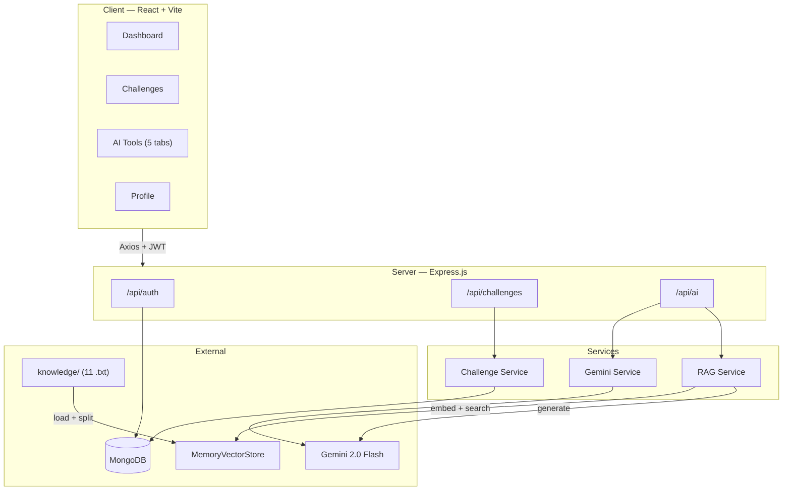

<div align="center">

# LeetCoach AI

**Daily coding challenges, AI-powered tutoring, and a RAG knowledge base — all in one dashboard.**

[](https://nodejs.org)
[](https://react.dev)
[](https://mongodb.com)
[](https://ai.google.dev)
[](https://langchain.com)

</div>

---

## Overview

LeetCoach is a full-stack web application that helps software engineers prepare for coding interviews through daily practice and AI assistance.

Each day, users receive one Easy, one Medium, and one Hard problem drawn from a pool of 60 seeded LeetCode-style questions. A streak system tracks consecutive days of practice. Five AI-powered study tools — hints, solution explainer, tutor chat, code review, and a vector-search knowledge base — provide on-demand help without giving away answers directly.

The backend runs an Express API with MongoDB for persistence and Google Gemini 2.0 Flash for all AI generation. A Retrieval-Augmented Generation (RAG) pipeline built on LangChain embeds 11 hand-written DSA study guides into an in-memory vector store and retrieves relevant context before generating answers.

---

## Features

### Daily Challenges
- Three problems assigned per day (Easy / Medium / Hard) with deduplication against the last 30 days
- Mark problems as complete with a single click; completion updates streak counters and total solved count
- Streak tracking — current streak, longest streak, and daily progress displayed on the dashboard
- Each problem includes a description, input/output examples, constraints, and a direct LeetCode link

### AI Study Tools
| Tool | What it does |
|------|-------------|
| **Progressive Hints** | Three-tier system: conceptual nudge → algorithmic direction → pseudocode guidance. Each tier can be revealed independently. |
| **Solution Explainer** | Generates four sections: beginner explanation (with analogies), detailed walkthrough, time complexity, and space complexity. |
| **AI Tutor Chat** | Interactive Q&A across 10 DSA topic categories. Messages persist within the session with a chat-style interface. |
| **Code Review** | Analyzes submitted code for logic correctness, bugs, time/space complexity, and optimization opportunities. Returns a score out of 10. |
| **Knowledge Base (RAG)** | Queries 11 DSA study guides using vector similarity search, retrieves the top 5 relevant chunks, and generates a cited answer. |

### RAG Pipeline
- 11 curated study guides covering arrays, binary search, dynamic programming, graphs, hashing, linked lists, queues, sliding window, stacks, trees, and two pointers
- Documents split into ~130 chunks using `RecursiveCharacterTextSplitter` (1000 chars, 200 overlap)
- Embedded with Google `text-embedding-004` via LangChain's `GoogleGenerativeAIEmbeddings`
- Stored in a `MemoryVectorStore` (in-process, no external database required)
- Cosine similarity retrieval → context augmentation → Gemini 2.0 Flash generation
- Source citations returned with every response
- Live status badge in the UI with expandable detail panel

### Authentication
- JWT-based registration and login with bcrypt password hashing (salt rounds: 12)
- Bearer token attached to all API requests via Axios interceptor
- Automatic 401 detection and redirect to login
- User state hydrated from localStorage with server-side verification on mount

### UI
- Grid-based application layout with a 240px sidebar (desktop), 72px icon-only sidebar (tablet), and slide-in drawer (mobile)
- Dark theme with layered surfaces, glass-morphism cards, and subtle grid background
- Skeleton loaders for AI responses and knowledge base results
- Toast notification system with auto-dismiss and progress bar
- Animated empty states, page transitions via Framer Motion, and smooth hover effects
- Custom dark scrollbar, accent-colored focus rings, and `prefers-reduced-motion` support

---

## Tech Stack

| Layer | Technologies |
|-------|-------------|
| **Frontend** | React 19, Vite 8, Tailwind CSS 4, Framer Motion, Lucide React |
| **Backend** | Node.js, Express 4, Mongoose ODM |
| **Database** | MongoDB (Atlas or local) |
| **AI** | Google Gemini 2.0 Flash (`@google/generative-ai`) |
| **RAG** | LangChain, `@langchain/google-genai` (text-embedding-004), `MemoryVectorStore` |
| **Auth** | JWT (`jsonwebtoken`), bcryptjs |
| **Dev Tools** | Nodemon, Morgan (HTTP logging) |

---

## Architecture



### RAG Query Flow

```
User question
  │
  ├─▶ Embed query → text-embedding-004 → 768-dim vector
  │
  ├─▶ Similarity search → MemoryVectorStore (top-5 chunks)
  │
  ├─▶ Build augmented prompt with retrieved context
  │
  └─▶ Generate → Gemini 2.0 Flash → { answer, sources[] }
```

---

## Project Structure

```
LeetCoach/
├── client/                          # Frontend
│   ├── src/
│   │   ├── api/index.js             # Axios instance, JWT interceptor, API methods
│   │   ├── components/
│   │   │   ├── Layout.jsx           # App shell — sidebar + main content grid
│   │   │   ├── EmptyState.jsx       # Animated placeholder for empty sections
│   │   │   ├── RAGStatusBadge.jsx   # Live RAG health indicator with detail panel
│   │   │   ├── SkeletonLoader.jsx   # Shimmer skeletons (4 variants)
│   │   │   └── Toast.jsx            # Toast system — provider, hook, auto-dismiss
│   │   ├── context/
│   │   │   └── AuthContext.jsx      # JWT auth state, login/register/logout
│   │   ├── pages/
│   │   │   ├── Dashboard.jsx        # Stats, progress bar, quick actions
│   │   │   ├── DailyChallenges.jsx  # Problem cards with mark-complete
│   │   │   ├── AIFeatures.jsx       # 5-tab AI tools interface
│   │   │   ├── Profile.jsx          # User stats and activity overview
│   │   │   ├── Login.jsx
│   │   │   └── Register.jsx
│   │   ├── App.jsx                  # Routes, ProtectedRoute, PublicRoute guards
│   │   ├── index.css                # Design system — tokens, layout, components
│   │   └── main.jsx                 # Entry — BrowserRouter, AuthProvider, ToastProvider
│   ├── index.html
│   ├── vite.config.js               # Dev server on :3000, proxy /api → :5000
│   └── package.json
│
├── server/                          # Backend
│   ├── config/db.js                 # MongoDB connection
│   ├── controllers/
│   │   ├── authController.js        # register, login, getMe
│   │   ├── challengeController.js   # generate, getToday, markComplete
│   │   └── aiController.js          # hints, explain, chat, review, ask, ragStatus
│   ├── middleware/
│   │   ├── auth.js                  # JWT verification guard
│   │   └── errorHandler.js          # Mongoose + generic error formatting
│   ├── models/
│   │   ├── User.js                  # name, email, password, streaks, totalSolved
│   │   ├── Problem.js               # title, difficulty, topic, examples, constraints
│   │   └── DailyChallenge.js        # userId, easy/medium/hard refs, completedProblems
│   ├── routes/
│   │   ├── authRoutes.js
│   │   ├── challengeRoutes.js
│   │   └── aiRoutes.js
│   ├── services/
│   │   ├── geminiService.js         # Gemini 2.0 Flash — hints, explain, chat, review
│   │   ├── ragService.js            # Full RAG pipeline — load, split, embed, query
│   │   └── challengeService.js      # Random problem selection, deduplication
│   ├── scripts/initRAG.js           # Standalone RAG pre-warm script
│   ├── data/seedProblems.js         # 60 LeetCode-style problems (20 per difficulty)
│   ├── knowledge/                   # 11 DSA study guides (~7–11 KB each)
│   │   ├── arrays.txt
│   │   ├── binary-search.txt
│   │   ├── dynamic-programming.txt
│   │   ├── graphs.txt
│   │   ├── hashing.txt
│   │   ├── linked-list.txt
│   │   ├── queue.txt
│   │   ├── sliding-window.txt
│   │   ├── stack.txt
│   │   ├── trees.txt
│   │   └── two-pointers.txt
│   ├── server.js                    # Express entry, RAG auto-init on startup
│   └── package.json
│
└── README.md
```

---

## Getting Started

### Prerequisites

- **Node.js** ≥ 18
- **MongoDB** — local install or [MongoDB Atlas](https://www.mongodb.com/atlas) (free tier works)
- **Gemini API Key** — [get one free](https://ai.google.dev/)

### 1. Clone

```bash
git clone https://github.com/your-username/LeetCoach.git
cd LeetCoach
```

### 2. Server

```bash
cd server
npm install
```

Create `server/.env`:

```env
PORT=5000
MONGO_URI=mongodb://localhost:27017/leetcoach
JWT_SECRET=your_jwt_secret_here
JWT_EXPIRE=30d
NODE_ENV=development
GEMINI_API_KEY=your_gemini_api_key_here
```

Seed the problem database:

```bash
npm run seed
```

(Optional) Pre-warm the RAG knowledge base:

```bash
npm run init-rag
```

Start the server:

```bash
npm run dev
```

The RAG knowledge base auto-initializes on startup. You'll see:

```
🧠 Initializing RAG Knowledge Base (in-process)...
   📄 Loaded 11 knowledge documents
   ✂️  Split into ~132 chunks
   ✅ RAG initialized! 132 chunks embedded in memory
```

### 3. Client

```bash
cd ../client
npm install
npm run dev
```

### 4. Open

Navigate to **http://localhost:3000**. The Vite dev server proxies `/api` requests to the Express server on port 5000.

---

## Environment Variables

| Variable | Required | Description |
|----------|----------|-------------|
| `PORT` | No | Server port (default: `5000`) |
| `MONGO_URI` | Yes | MongoDB connection string |
| `JWT_SECRET` | Yes | Secret key for signing JWT tokens |
| `JWT_EXPIRE` | No | Token expiration (default: `30d`) |
| `NODE_ENV` | No | `development` enables Morgan logging and error stacks |
| `GEMINI_API_KEY` | Yes | Google Gemini API key for AI features and embeddings |

---

## API Endpoints

### Authentication

| Method | Endpoint | Body | Auth | Description |
|--------|----------|------|------|-------------|
| `POST` | `/api/auth/register` | `{ name, email, password }` | No | Create account |
| `POST` | `/api/auth/login` | `{ email, password }` | No | Sign in, returns JWT |
| `GET` | `/api/auth/me` | — | Yes | Get current user profile |

### Challenges

| Method | Endpoint | Body | Description |
|--------|----------|------|-------------|
| `POST` | `/api/challenges/generate` | — | Generate today's challenge (idempotent) |
| `GET` | `/api/challenges/today` | — | Get today's challenge with populated problems |
| `PUT` | `/api/challenges/complete/:id` | — | Mark a problem complete, update streaks |

### AI Tools

| Method | Endpoint | Body | Description |
|--------|----------|------|-------------|
| `POST` | `/api/ai/hints` | `{ problemDescription, difficulty }` | 3-tier progressive hints |
| `POST` | `/api/ai/explain` | `{ problemDescription, difficulty }` | Solution explanation (4 sections) |
| `POST` | `/api/ai/chat` | `{ topic, question }` | Interactive tutor response |
| `POST` | `/api/ai/review` | `{ code, problemDescription? }` | Code review with score |
| `POST` | `/api/ai/ask` | `{ question }` | RAG knowledge base query |
| `GET` | `/api/ai/rag-status` | — | Vector store health check |

All AI and challenge endpoints require `Authorization: Bearer <token>`.

---

## Usage

1. **Register** an account or **log in** with existing credentials
2. Navigate to **Challenges** and click **Generate Challenges** to get your daily set
3. Read each problem, attempt it on LeetCode via the external link, then **Mark Complete**
4. Use **AI Tools** when stuck:
   - Paste a problem description into **Hints** for progressive guidance
   - Use **Explainer** for a full walkthrough with complexity analysis
   - Ask the **Tutor** about any DSA topic
   - Paste your solution into **Code Review** for feedback and scoring
   - Search the **Knowledge Base** for concept explanations pulled from curated study guides
5. Track your streak and stats on the **Dashboard** and **Profile** pages

---

## Screenshots

> Add screenshots of your running application here.

### Dashboard
`(screenshot)`

### Daily Challenges
`(screenshot)`

### AI Tools — Hints
`(screenshot)`

### AI Tools — Knowledge Base (RAG)
`(screenshot)`

### Profile
`(screenshot)`

---

## Troubleshooting

### RAG doesn't initialize
1. Verify `GEMINI_API_KEY` is set in `server/.env`
2. Run `npm run init-rag` to test in isolation and see detailed errors
3. Confirm the `server/knowledge/` directory contains 11 `.txt` files

### MongoDB connection fails
- For Atlas: check your IP is whitelisted and the connection string includes the database name
- For local: ensure `mongod` is running

### Port conflicts
- Server default: `5000` (change via `PORT` in `.env`)
- Client default: `3000` (change in `vite.config.js`)

---

## Future Improvements

- Spaced repetition system for problem scheduling
- User-submitted solutions stored and compared over time
- Leaderboard with weekly/monthly rankings
- Problem filtering by topic and difficulty
- Persistent tutor chat history across sessions
- Dark/light theme toggle
- Deployment configs for Vercel (client) and Railway/Render (server)

---

## Contributing

1. Fork the repository
2. Create a feature branch (`git checkout -b feature/your-feature`)
3. Commit your changes (`git commit -m 'Add your feature'`)
4. Push to the branch (`git push origin feature/your-feature`)
5. Open a Pull Request

---

## License

This project is open source.

---

<div align="center">

**Built with Gemini AI, LangChain, React, and MongoDB**

</div>
